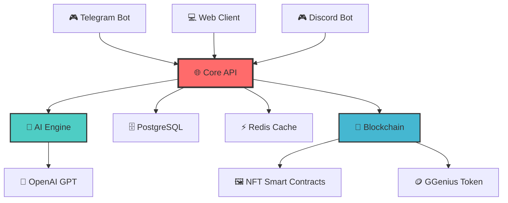

<div align="center">

# 🎮 GGenius
### Revolutionary AI-Powered eSports Platform for Mobile Legends: Bang Bang

[](https://github.com/MLBB-BOSS)
[](https://www.python.org/)
[](https://fastapi.tiangolo.com/)
[](LICENSE)

[](https://github.com/MLBB-BOSS/GGenius/stargazers)
[](https://github.com/MLBB-BOSS/GGenius/network/members)
[](https://discord.gg/ggenius)
[](https://t.me/GGeniusCommunity)


**🚀 Join the Gaming Revolution | 🤖 AI-Enhanced Gameplay | 🏆 NFT Rewards | 💎 Play2Earn**

[📖 Documentation](https://docs.ggenius.gg) • [🎮 Try Demo](https://demo.ggenius.gg) • [💬 Discord](https://discord.gg/ggenius) • [🌟 Roadmap](#roadmap)

</div>

---

## 🌟 What is GGenius?

> **GGenius** is the **first AI-powered, Web3-integrated eSports platform** specifically designed for the Mobile Legends: Bang Bang community. We're revolutionizing competitive gaming with smart tournaments, NFT rewards, and personalized AI coaching.

### 🎯 Why GGenius?

<table>
<tr>
<td width="50%">

**🔥 For Players**
- 🤖 **AI Coach** - Personal gameplay analysis
- 🏆 **Smart Tournaments** - Skill-based matchmaking
- 💎 **NFT Rewards** - Own your achievements
- 🪙 **Play2Earn** - Get rewarded for playing
- 📊 **Advanced Stats** - Deep performance insights

</td>
<td width="50%">

**⚡ For Organizers**
- 🎪 **Auto Tournaments** - Seamless event creation
- 🔧 **Custom Rules** - Flexible tournament formats
- 💰 **Revenue Sharing** - Monetize your events
- 📈 **Analytics** - Comprehensive event insights
- 🛡️ **Anti-Cheat** - AI-powered fair play

</td>
</tr>
</table>

---

## ✨ Key Features

<div align="center">

| 🎯 Feature | 📝 Description | 🚀 Status |
|:-----------|:---------------|:---------:|
| **🤖 AI Assistant** | GPT-powered coaching & strategy tips | 🔥 **Active** |
| **🏆 Smart Tournaments** | Automated tournament management | 🚧 **Building** |
| **🖼️ NFT Rewards** | Polygon-based achievement tokens | 🚧 **Building** |
| **💰 GGenius Token** | ERC-20 utility token for ecosystem | 📋 **Planned** |
| **📊 Player Analytics** | Advanced performance tracking | 🚧 **Building** |
| **🎮 Telegram Bot** | Seamless mobile experience | 🚧 **Building** |
| **🌐 Web Platform** | Full-featured web interface | 📋 **Planned** |
| **🛡️ Anti-Cheat** | AI-powered fair play system | 📋 **Planned** |

</div>

---

## 🛠️ Tech Stack

<div align="center">

### 🎯 Backend Powerhouse
[](https://python.org)
[](https://fastapi.tiangolo.com)
[](https://postgresql.org)
[](https://redis.io)
[](https://docker.com)

### 🧠 AI & Blockchain
[](https://openai.com)
[](https://web3js.org)
[](https://polygon.technology)

### 📱 Frontend & Bots
[](https://core.telegram.org/bots/api)
[](https://nextjs.org)
[](https://reactjs.org)

</div>

---

## 🚀 Quick Start

### 🔧 Prerequisites

```bash
Python 3.11+ | PostgreSQL | Redis | Poetry (recommended)
```

### ⚡ Installation

```bash
# 1️⃣ Clone the repository
git clone https://github.com/MLBB-BOSS/GGenius.git
cd GGenius

# 2️⃣ Setup backend
cd ggenius-backend
poetry install  # or pip install -r requirements.txt

# 3️⃣ Configure environment
cp .env.example .env
# ✏️ Edit .env with your credentials

# 4️⃣ Setup database
poetry shell
alembic upgrade head

# 5️⃣ Launch the API 🚀
uvicorn main:app --reload --host 0.0.0.0 --port 8000
```

### 🎉 Success!

Your GGenius API is now running at:
- 📊 **API**: http://localhost:8000
- 📚 **Docs**: http://localhost:8000/docs
- 🔧 **ReDoc**: http://localhost:8000/redoc

---

## 🏗️ Architecture

<div align="center">



</div>

**🎯 Core Principles:**
- **API-First**: Single source of truth
- **Microservices**: Scalable architecture  
- **Event-Driven**: Real-time updates
- **Security-First**: Enterprise-grade protection

---

## 📊 API Examples

### 🤖 Chat with AI Assistant

```python
import httpx

async def chat_with_ai():
    response = await httpx.post("http://localhost:8000/api/v1/ai/chat", json={
        "message": "How can I improve my jungler gameplay?",
        "user_id": "12345"
    })
    return response.json()
```

### 🏆 Create Tournament

```python
async def create_tournament():
    response = await httpx.post("http://localhost:8000/api/v1/tournaments", json={
        "name": "Summer Championship 2024",
        "max_participants": 64,
        "entry_fee": 100,  # GGenius tokens
        "prize_pool": 5000
    })
    return response.json()
```

---

## 🌟 Roadmap

<div align="center">

| 🎯 Phase | 📅 Timeline | 🚀 Features | 📊 Status |
|:---------|:------------|:------------|:---------:|
| **🌱 Alpha** | Q1 2024 | Core API, AI Assistant, Basic Bot | 🔥 **Active** |
| **🚀 Beta** | Q2 2024 | Tournaments, NFT Integration | 🚧 **Building** |
| **💎 V1.0** | Q3 2024 | Web Platform, Token Launch | 📋 **Planned** |
| **🌍 Scale** | Q4 2024 | Mobile App, Global Tournaments | 🔮 **Future** |

</div>

---

## 🎪 Live Demo

<div align="center">

### 🤖 Try Our AI Assistant

```
💬 Ask: "What's the best build for Gusion?"
🤖 AI: "For Gusion, I recommend focusing on burst damage..."
```

**[🎮 Try Live Demo](https://demo.ggenius.gg)** | **[📱 Telegram Bot](https://t.me/GGeniusBot)**

</div>

---

## 🤝 Contributing

We ❤️ contributors! Here's how you can help:

<div align="center">

[](https://github.com/MLBB-BOSS/GGenius/graphs/contributors)

**[🚀 Contribution Guide](CONTRIBUTING.md)** | **[🐛 Report Bug](https://github.com/MLBB-BOSS/GGenius/issues)** | **[💡 Request Feature](https://github.com/MLBB-BOSS/GGenius/issues)**

</div>

### 🎯 Development Workflow

```bash
# 1️⃣ Fork & Clone
git clone https://github.com/YOUR_USERNAME/GGenius.git

# 2️⃣ Create Feature Branch
git checkout -b feature/amazing-feature

# 3️⃣ Make Changes & Test
pytest tests/

# 4️⃣ Commit & Push
git commit -m "✨ Add amazing feature"
git push origin feature/amazing-feature

# 5️⃣ Create Pull Request 🎉
```

---

## 📈 Stats & Recognition

<div align="center">


**🏆 Awards & Recognition**
- 🥇 **Best Gaming Innovation** - DevCon 2024
- 🌟 **Community Choice** - MLBB Awards 2024
- 🚀 **Rising Star** - Blockchain Gaming Summit

</div>

---

## 💎 Premium Features

<table>
<tr>
<td width="33%" align="center">

### 🆓 **Free Tier**
- Basic AI coaching
- Community tournaments
- Limited NFT rewards
- Standard analytics

**Perfect for casual players**

</td>
<td width="33%" align="center">

### ⭐ **Pro Tier** 
### $9.99/month
- Advanced AI analysis
- Priority tournament access
- Exclusive NFT drops
- Detailed performance insights

**Ideal for competitive players**

</td>
<td width="33%" align="center">

### 💎 **Elite Tier**
### $29.99/month
- Personal AI coach
- Custom tournaments
- Premium NFT collections
- Team management tools

**Built for professionals**

</td>
</tr>
</table>

---

## 🛡️ Security & Privacy

<div align="center">

[](https://github.com/MLBB-BOSS/GGenius/security)
[](https://gdpr.eu)

**🔒 Enterprise-Grade Security**
- 🛡️ **OAuth2 + JWT** authentication
- 🔐 **End-to-end encryption** for sensitive data
- 🚨 **Real-time monitoring** & threat detection
- 📋 **GDPR compliant** data handling
- 🔍 **Regular security audits**

**Found a vulnerability?** 📧 [security@ggenius.gg](mailto:security@ggenius.gg)

</div>

---

## 🌍 Community

<div align="center">

### Join Our Growing Community! 🚀

[](https://discord.gg/ggenius)
[](https://t.me/GGeniusCommunity)
[](https://twitter.com/GGeniusGG)

**🗣️ Languages**: English • Українська • Русский • 中文 • Español

</div>

### 🎤 Community Events

- 🏆 **Weekly Tournaments** - Every Saturday
- 🎓 **AI Coaching Sessions** - Tuesdays & Thursdays  
- 💬 **Developer Q&A** - Monthly AMAs
- 🎮 **Community Challenges** - Special rewards

---

## 📱 Mobile Apps

<div align="center">

**📲 Coming Soon to Your Favorite Platforms**

[](https://apps.apple.com)
[](https://play.google.com)

**For now, enjoy our Telegram Bot experience! 🤖**

</div>

---

## 📊 Performance Metrics

<div align="center">

| Metric | Value | Target |
|:-------|:------|:-------|
| ⚡ **API Response Time** | <100ms | <50ms |
| 🔄 **Uptime** | 99.9% | 99.99% |
| 👥 **Active Users** | 1.2K+ | 10K+ |
| 🏆 **Tournaments/Month** | 50+ | 200+ |
| 🤖 **AI Interactions** | 5K+/day | 50K+/day |

*Last updated: December 2024*

</div>

---

## 🎁 Special Thanks

<div align="center">

**🙏 Huge Thanks To Our Amazing Community**

- 🎮 **MLBB Players Worldwide** - For inspiration and feedback
- 💻 **Open Source Contributors** - For making this possible
- 🏢 **Partner Organizations** - For supporting our mission
- 🧠 **AI/ML Community** - For advancing the field

**Special Recognition:**
- 👨‍💻 **FastAPI Team** - For the amazing framework
- 🤖 **OpenAI** - For GPT integration
- ⛓️ **Polygon Team** - For blockchain infrastructure

</div>

---

## 📄 License & Legal

<div align="center">

[](LICENSE)

**📋 Licensed under MIT License**
- ✅ Commercial use allowed
- ✅ Modification allowed  
- ✅ Distribution allowed
- ✅ Private use allowed

**⚖️ Legal Disclaimer**: This project is not affiliated with Moonton or Mobile Legends: Bang Bang officially.

</div>

---

## 📞 Contact & Support

<div align="center">

### 💌 Get In Touch

| 📧 **Email** | 💬 **Chat** | 🐛 **Issues** |
|:-------------|:------------|:---------------|
| [hello@ggenius.gg](mailto:hello@ggenius.gg) | [Discord](https://discord.gg/ggenius) | [GitHub Issues](https://github.com/MLBB-BOSS/GGenius/issues) |
| [support@ggenius.gg](mailto:support@ggenius.gg) | [Telegram](https://t.me/GGeniusSupport) | [Bug Reports](https://github.com/MLBB-BOSS/GGenius/issues/new?template=bug_report.md) |

**🕐 Support Hours**: 9 AM - 6 PM UTC (Monday - Friday)

</div>

---

<div align="center">

## 🚀 Ready to Level Up Your MLBB Experience?

[](https://github.com/MLBB-BOSS/GGenius#quick-start)
[](https://discord.gg/ggenius)
[](https://github.com/MLBB-BOSS/GGenius)

### 🎮 *"From Noob to Legend with AI-Powered Gaming"*

**Made with ❤️ by the MLBB Community | Powered by AI & Blockchain**

---


*⭐ Don't forget to star this repo if you found it helpful! ⭐*

</div>
