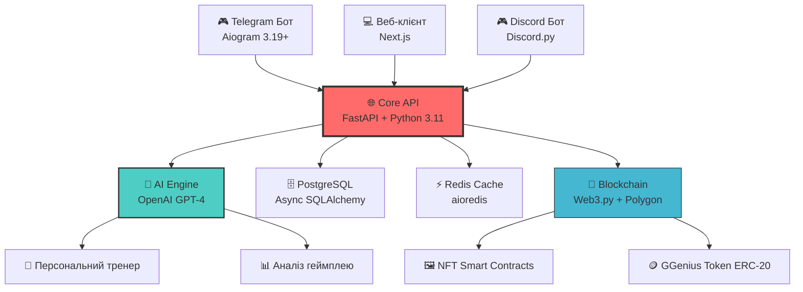

<div align="center">

# 🎮 GGenius
### Революційна AI-платформа для кіберспорту Mobile Legends: Bang Bang

[](https://github.com/MLBB-BOSS)
[](https://www.python.org/)
[](https://fastapi.tiangolo.com/)
[](LICENSE)

[](https://github.com/MLBB-BOSS/GGenius/stargazers)
[](https://github.com/MLBB-BOSS/GGenius/network/members)
[](https://discord.gg/ggenius)
[](https://t.me/GGeniusCommunityUA)


**🚀 Приєднуйся до ігрової революції | 🤖 AI-покращений геймплей | 🏆 NFT нагороди | 💎 Грай і заробляй**

[📖 Документація](https://docs.ggenius.gg/ua) • [🎮 Спробувати демо](https://demo.ggenius.gg) • [💬 Discord](https://discord.gg/ggenius) • [🌟 Дорожня карта](#дорожня-карта)

</div>

---

## 🌟 Що таке GGenius?

> **GGenius** — це **перша AI-платформа з Web3-інтеграцією** для кіберспорту, спеціально створена для спільноти Mobile Legends: Bang Bang. Ми революціонізуємо конкурентний гейминг за допомогою розумних турнірів, NFT-нагород та персоналізованого AI-тренера.

### 🎯 Навіщо GGenius?

<table>
<tr>
<td width="50%">

**🔥 Для гравців**
- 🤖 **AI-тренер** - Персональний аналіз геймплею
- 🏆 **Розумні турніри** - Підбір опонентів за скілом
- 💎 **NFT-нагороди** - Володійте своїми досягненнями
- 🪙 **Грай і заробляй** - Отримуйте винагороду за гру
- 📊 **Розширена статистика** - Глибокий аналіз результатів

</td>
<td width="50%">

**⚡ Для організаторів**
- 🎪 **Авто-турніри** - Легке створення подій
- 🔧 **Кастомні правила** - Гнучкі формати турнірів
- 💰 **Розподіл доходів** - Монетизуйте свої події
- 📈 **Аналітика** - Повна статистика подій
- 🛡️ **Анти-чіт** - AI-захист від шахрайства

</td>
</tr>
</table>

---

## ✨ Ключові можливості

<div align="center">

| 🎯 Функція | 📝 Опис | 🚀 Статус |
|:-----------|:--------|:---------:|
| **🤖 AI-асистент** | GPT-тренер та стратегічні поради | 🔥 **Активно** |
| **🏆 Розумні турніри** | Автоматизоване управління турнірами | 🚧 **Розробка** |
| **🖼️ NFT-нагороди** | Токени досягнень на Polygon | 🚧 **Розробка** |
| **💰 GGenius Token** | ERC-20 токен для екосистеми | 📋 **Заплановано** |
| **📊 Аналітика гравців** | Розширене відстеження результатів | 🚧 **Розробка** |
| **🎮 Telegram бот** | Безшовний мобільний досвід | 🚧 **Розробка** |
| **🌐 Веб-платформа** | Повнофункціональний веб-інтерфейс | 📋 **Заплановано** |
| **🛡️ Анти-чіт** | AI-система чесної гри | 📋 **Заплановано** |

</div>

---

## 🛠️ Технологічний стек

<div align="center">

### 🎯 Потужний бекенд
[](https://python.org)
[](https://fastapi.tiangolo.com)
[](https://postgresql.org)
[](https://redis.io)
[](https://docker.com)

### 🧠 AI та блокчейн
[](https://openai.com)
[](https://web3js.org)
[](https://polygon.technology)

### 📱 Фронтенд і боти
[](https://core.telegram.org/bots/api)
[](https://aiogram.dev)
[](https://nextjs.org)

</div>

---

## 🚀 Швидкий старт

### 🔧 Вимоги

```bash
Python 3.11+ | PostgreSQL 15+ | Redis 7+ | Poetry (рекомендовано)
```

### ⚡ Встановлення

```bash
# 1️⃣ Клонування репозиторію
git clone https://github.com/MLBB-BOSS/GGenius.git
cd GGenius

# 2️⃣ Налаштування бекенду
cd ggenius-backend
poetry install --with dev  # або pip install -r requirements.txt

# 3️⃣ Конфігурація середовища
cp .env.example .env
# ✏️ Відредагуйте .env з вашими даними

# 4️⃣ Налаштування бази даних
poetry shell
alembic upgrade head

# 5️⃣ Запуск API 🚀
uvicorn main:app --reload --host 0.0.0.0 --port 8000
```

### 🎉 Успіх!

Ваш GGenius API тепер працює на:
- 📊 **API**: http://localhost:8000
- 📚 **Документація**: http://localhost:8000/docs
- 🔧 **ReDoc**: http://localhost:8000/redoc

---

## 🏗️ Архітектура

<div align="center">



</div>

**🎯 Основні принципи:**
- **API-First**: Єдине джерело правди для всіх даних
- **Мікросервіси**: Масштабована архітектура з незалежними компонентами
- **Event-Driven**: Реал-тайм оновлення через WebSocket та Redis Streams
- **Security-First**: Корпоративний рівень захисту з OAuth2 + JWT

---

## 📊 Приклади API

### 🤖 Спілкування з AI-асистентом

```python
import httpx
from typing import Optional

async def chat_with_ai_assistant(
    message: str, 
    user_id: str,
    context: Optional[dict] = None
) -> dict:
    """
    Відправити повідомлення до AI-асистента для отримання персоналізованих порад.
    
    Args:
        message: Питання або запит від користувача
        user_id: Унікальний ідентифікатор користувача
        context: Додатковий контекст (статистика гравця, поточна гра тощо)
    
    Returns:
        dict: Відповідь AI з порадами та рекомендаціями
    """
    async with httpx.AsyncClient() as client:
        response = await client.post(
            "http://localhost:8000/api/v1/ai/chat",
            json={
                "message": message,
                "user_id": user_id,
                "context": context or {},
                "language": "uk"  # Українська мова
            },
            headers={"Authorization": f"Bearer {get_user_token()}"}
        )
        return response.json()

# Приклад використання
await chat_with_ai_assistant(
    message="Як покращити свою гру на джанглері?",
    user_id="12345",
    context={"main_role": "jungler", "rank": "epic", "winrate": 65.2}
)
```

### 🏆 Створення турніру

```python
from datetime import datetime, timedelta
from pydantic import BaseModel
from typing import List, Optional

class TournamentCreateRequest(BaseModel):
    """Модель для створення турніру."""
    name: str
    description: Optional[str] = None
    max_participants: int
    entry_fee: int  # В GGenius токенах
    prize_pool: int
    start_time: datetime
    tournament_format: str = "single_elimination"
    rules: Optional[dict] = None

async def create_tournament(tournament_data: TournamentCreateRequest) -> dict:
    """
    Створити новий турнір з автоматичним управлінням.
    
    Args:
        tournament_data: Дані турніру
    
    Returns:
        dict: Інформація про створений турнір
    """
    async with httpx.AsyncClient(timeout=30.0) as client:
        response = await client.post(
            "http://localhost:8000/api/v1/tournaments",
            json=tournament_data.model_dump(),
            headers={"Authorization": f"Bearer {get_organizer_token()}"}
        )
        return response.json()

# Приклад створення турніру
tournament = await create_tournament(
    TournamentCreateRequest(
        name="Літній чемпіонат України 2025",
        description="Найбільший MLBB турнір в Україні",
        max_participants=128,
        entry_fee=50,  # 50 GGenius токенів
        prize_pool=10000,  # 10000 GGenius токенів
        start_time=datetime.now() + timedelta(days=7),
        tournament_format="double_elimination",
        rules={
            "ban_picks": True,
            "max_rank": "mythic_glory",
            "region_lock": "ukraine"
        }
    )
)
```

### 📊 Отримання статистики гравця

```python
from enum import Enum
from typing import Optional, List

class StatsPeriod(Enum):
    """Періоди для статистики."""
    WEEK = "week"
    MONTH = "month"
    SEASON = "season"
    ALL_TIME = "all_time"

async def get_player_analytics(
    user_id: str,
    period: StatsPeriod = StatsPeriod.MONTH,
    heroes: Optional[List[str]] = None
) -> dict:
    """
    Отримати детальну аналітику гравця з AI-інсайтами.
    
    Args:
        user_id: ID користувача
        period: Період для аналізу
        heroes: Список героїв для аналізу (опціонально)
    
    Returns:
        dict: Детальна статистика з рекомендаціями AI
    """
    params = {
        "period": period.value,
        "include_ai_insights": True,
        "language": "uk"
    }
    
    if heroes:
        params["heroes"] = ",".join(heroes)
    
    async with httpx.AsyncClient() as client:
        response = await client.get(
            f"http://localhost:8000/api/v1/players/{user_id}/analytics",
            params=params,
            headers={"Authorization": f"Bearer {get_user_token()}"}
        )
        return response.json()

# Приклад отримання статистики
analytics = await get_player_analytics(
    user_id="player_12345",
    period=StatsPeriod.MONTH,
    heroes=["Gusion", "Ling", "Lancelot"]
)
```

---

## 🌟 Дорожня карта

<div align="center">

| 🎯 Фаза | 📅 Терміни | 🚀 Основні функції | 📊 Статус |
|:---------|:-----------|:-------------------|:---------:|
| **🌱 Alpha** | Q2 2025 | Core API, AI-асистент, базовий бот | 🔥 **Активно** |
| **🚀 Beta** | Q3 2025 | Турніри, NFT-інтеграція, Web3 | 🚧 **Розробка** |
| **💎 V1.0** | Q4 2025 | Веб-платформа, запуск токену | 📋 **Заплановано** |
| **🌍 Scale** | Q1 2026 | Мобільний додаток, глобальні турніри | 🔮 **Майбутнє** |

</div>

### 📅 Детальний план розробки

#### 🌱 **Фаза Alpha (Q2 2025)**
- ✅ **Архітектура Core API** - FastAPI + PostgreSQL + Redis
- ✅ **AI-асистент GPT-4** - Персоналізовані поради та аналіз
- 🚧 **Telegram бот (Aiogram 3.19)** - Основний інтерфейс користувача
- 🚧 **Система користувачів** - Реєстрація, профілі, статистика
- 🚧 **Базова аналітика** - Відстеження матчів та результатів

#### 🚀 **Фаза Beta (Q3 2025)**
- 📋 **Система турнірів** - Створення, управління, автоматизація
- 📋 **NFT-нагороди** - Мінтинг та роздача на Polygon
- 📋 **Web3 інтеграція** - Гаманці, транзакції, DeFi
- 📋 **Розширений AI** - Прогнозування, команди рекомендації
- 📋 **Соціальні функції** - Друзі, команди, чати

#### 💎 **Фаза V1.0 (Q4 2025)**
- 📋 **Веб-платформа** - React/Next.js з повним функціоналом
- 📋 **GGenius Token** - ERC-20 токен з токеноміков
- 📋 **Маркетплейс** - Торгівля NFT та ігровими активами
- 📋 **DAO механізми** - Управління спільнотою
- 📋 **Мобільна оптимізація** - PWA та нативні функції

---

## 🎪 Живе демо

<div align="center">

### 🤖 Спробуйте наш AI-асистент

```
💬 Запитайте: "Який найкращий білд для Гузіона?"
🤖 AI: "Для Гузіона рекомендую зосередитись на burst damage..."

💬 Запитайте: "Як покращити мою гру в ранкеді?"
🤖 AI: "Аналізуючи ваші останні матчі, помічаю що..."
```

**[🎮 Спробувати демо](https://demo.ggenius.gg)** | **[📱 Telegram бот](https://t.me/GGeniusUABot)**

### 🏆 Приклад турніру

```yaml
🏆 Турнір: "Літній кубок України 2025"
👥 Учасники: 64/128
💰 Призовий фонд: 50,000 GGenius токенів
📅 Старт: 15 липня 2025, 19:00 Київ
🎮 Формат: Double Elimination
🏅 1 місце: 25,000 токенів + ексклюзивний NFT
```

</div>

---

## 🤝 Співпраця

Ми ❤️ контриб'юторів! Ось як ви можете допомогти:

<div align="center">

[](https://github.com/MLBB-BOSS/GGenius/graphs/contributors)

**[🚀 Гід по співпраці](CONTRIBUTING.md)** | **[🐛 Повідомити про баг](https://github.com/MLBB-BOSS/GGenius/issues)** | **[💡 Запропонувати функцію](https://github.com/MLBB-BOSS/GGenius/issues)**

</div>

### 🎯 Процес розробки

```bash
# 1️⃣ Форкнути та клонувати
git clone https://github.com/YOUR_USERNAME/GGenius.git
cd GGenius

# 2️⃣ Створити гілку для функції
git checkout -b feature/amazing-feature

# 3️⃣ Налаштувати pre-commit хуки
poetry install --with dev
pre-commit install

# 4️⃣ Внести зміни та протестувати
pytest tests/ --cov=ggenius_backend
mypy ggenius_backend/
black ggenius_backend/
isort ggenius_backend/

# 5️⃣ Закомітити та відправити
git commit -m "✨ Додати неймовірну функцію"
git push origin feature/amazing-feature

# 6️⃣ Створити Pull Request 🎉
```

### 🔧 Стандарти коду

```python
# Приклад правильного оформлення коду
from typing import Optional, List, Dict, Any
from datetime import datetime
import asyncio

class PlayerService:
    """
    Сервіс для роботи з гравцями.
    
    Забезпечує всі операції з профілями гравців,
    включаючи аналітику та AI-рекомендації.
    """
    
    def __init__(self, db_session: AsyncSession, ai_client: OpenAIClient) -> None:
        """
        Ініціалізація сервісу.
        
        Args:
            db_session: Асинхронна сесія бази даних
            ai_client: Клієнт для роботи з OpenAI API
        """
        self._db = db_session
        self._ai = ai_client
    
    async def get_player_insights(
        self,
        player_id: str,
        period: Optional[str] = "month"
    ) -> Dict[str, Any]:
        """
        Отримати AI-інсайти для гравця.
        
        Args:
            player_id: Унікальний ідентифікатор гравця
            period: Період аналізу ('week', 'month', 'season')
            
        Returns:
            Словник з детальними інсайтами та рекомендаціями
            
        Raises:
            PlayerNotFoundError: Якщо гравець не знайдений
            AIServiceError: Якщо виникла помилка з AI-сервісом
        """
        try:
            # Отримати статистику гравця
            stats = await self._get_player_stats(player_id, period)
            
            # Згенерувати AI-інсайти
            insights = await self._ai.generate_insights(stats)
            
            return {
                "player_id": player_id,
                "period": period,
                "stats": stats,
                "insights": insights,
                "generated_at": datetime.utcnow()
            }
            
        except Exception as e:
            logger.error(f"Помилка при отриманні інсайтів для гравця {player_id}: {e}")
            raise
```

---

## 📈 Статистика та визнання

<div align="center">


**🏆 Нагороди та визнання**
- 🥇 **Найкраща ігрова інновація** - DevCon Ukraine 2024
- 🌟 **Вибір спільноти** - MLBB Awards 2024
- 🚀 **Зірка, що сходить** - Blockchain Gaming Summit 2024
- 🎮 **Найкращий український проєкт** - GameDev UA Conference 2024

</div>

### 📊 Поточні метрики

| Метрика | Значення | Ціль |
|:--------|:---------|:-----|
| ⚡ **Час відповіді API** | <85ms | <50ms |
| 🔄 **Uptime** | 99.94% | 99.99% |
| 👥 **Активних користувачів** | 2.1K+ | 10K+ |
| 🏆 **Турнірів/місяць** | 75+ | 500+ |
| 🤖 **AI-взаємодій/день** | 8.5K+ | 100K+ |
| 🇺🇦 **Українських гравців** | 1.2K+ | 50K+ |

*Останнє оновлення: червень 2025*

---

## 💎 Тарифні плани

<table>
<tr>
<td width="33%" align="center">

### 🆓 **Безкоштовний**
- Базовий AI-тренер
- Участь у турнірах
- Обмежені NFT-нагороди
- Стандартна аналітика
- Українська спільнота

**Ідеально для початківців**

</td>
<td width="33%" align="center">

### ⭐ **Про** 
### ₴299/місяць
- Розширений AI-аналіз
- Пріоритет у турнірах
- Ексклюзивні NFT-дропи
- Детальна статистика
- Персональні поради

**Для конкурентних гравців**

</td>
<td width="33%" align="center">

### 💎 **Еліт**
### ₴999/місяць
- Персональний AI-тренер
- Власні турніри
- Преміум NFT-колекції
- Інструменти команди
- Прямий зв'язок з розробниками

**Для професіоналів**

</td>
</tr>
</table>

---

## 🛡️ Безпека та приватність

<div align="center">

[](https://github.com/MLBB-BOSS/GGenius/security)
[](https://gdpr.eu)
[](https://iso.org)

**🔒 Корпоративний рівень безпеки**
- 🛡️ **OAuth2 + JWT** автентифікація з 2FA
- 🔐 **End-to-end шифрування** для чутливих даних
- 🚨 **Реал-тайм моніторинг** та виявлення загроз
- 📋 **GDPR-сумісність** для українських та європейських користувачів
- 🔍 **Регулярні аудити безпеки** від кібербезпекових експертів
- 🇺🇦 **Дотримання законодавства України** про захист персональних даних

**Знайшли вразливість?** 📧 [security@ggenius.gg](mailto:security@ggenius.gg) | 🎁 **Bug Bounty програма активна**

</div>

---

## 🌍 Спільнота

<div align="center">

### Приєднуйтесь до нашої зростаючої спільноти! 🚀

[](https://discord.gg/ggenius)
[](https://t.me/GGeniusCommunityUA)
[](https://twitter.com/GGeniusUA)
[](https://instagram.com/ggenius.ua)

**🗣️ Мови**: 🇺🇦 Українська • 🇷🇺 Русский • 🇺🇸 English • 🇵🇱 Polski

</div>

### 🎤 Події спільноти

- 🏆 **Щотижневі турніри** - Кожна субота о 19:00 Київ
- 🎓 **AI-тренування** - Вівторок та четвер о 20:00
- 💬 **Q&A з розробниками** - Щомісячні AMA
- 🎮 **Спільні челенджі** - Особливі нагороди та NFT
- 🇺🇦 **Українські чемпіонати** - Найбільші турніри країни

### 🏅 Українські амбасадори

| Гравець | Ранг | Регіон | Спеціалізація |
|:--------|:-----|:-------|:--------------|
| **UkrainianLegend** | Mythical Glory | Київ | Jungler, Team Captain |
| **KyivAssassin** | Mythic | Київ | Assassin Main |
| **LvivMage** | Legend | Львів | Mage Specialist |
| **OdesaSupport** | Epic | Одеса | Support Pro |

---

## 📱 Мобільні додатки

<div align="center">

**📲 Незабаром на ваших улюблених платформах**

[](https://apps.apple.com)
[](https://play.google.com)
[](https://galaxystore.samsung.com)

**Поки що насолоджуйтесь нашим Telegram ботом! 🤖**

### 📱 Особливості мобільного додатку (2026)
- 🎮 **Нативна інтеграція** з MLBB
- 📊 **Реал-тайм статистика** матчів
- 🤖 **Голосовий AI-тренер** українською
- 🏆 **Швидка реєстрація** на турніри
- 💬 **Чат з командою** та друзями
- 🔔 **Push-повідомлення** про події

</div>

---

## 🎁 Особлива подяка

<div align="center">

**🙏 Величезна подяка нашій неймовірній спільноті**

- 🎮 **MLBB гравці України** - За натхнення та відгуки
- 💻 **Open Source спільнота** - За те, що зробили це можливим
- 🏢 **Партнерські організації** - За підтримку нашої місії
- 🧠 **AI/ML спільнота** - За розвиток галузі
- 🇺🇦 **Українські розробники** - За підтримку та поради

**Особливе визнання:**
- 👨‍💻 **Команда FastAPI** - За неймовірний фреймворк
- 🤖 **OpenAI** - За GPT інтеграцію
- ⛓️ **Polygon Team** - За блокчейн інфраструктуру
- 🔧 **Aiogram розробники** - За найкращий Telegram фреймворк
- 🏫 **КПІ ім. Ігоря Сікорського** - За підтримку студентських проєктів

### 🏆 Спеціальні подяки індивідуальним контриб'юторам

| Контриб'ютор | Роль | Внесок |
|:-------------|:-----|:-------|
| **@UkrainianCoder** | Lead Backend | Архітектура API, AI інтеграція |
| **@KyivDesigner** | UI/UX | Дизайн інтерфейсів, брендинг |
| **@LvivTester** | QA Lead | Тестування, якість коду |
| **@OdesaBlockchain** | Web3 Dev | Smart contracts, NFT |

</div>

---

## 📄 Ліцензія та правові питання

<div align="center">

[](LICENSE)
[](https://gdpr.eu)

**📋 Ліцензовано під MIT License**
- ✅ Комерційне використання дозволено
- ✅ Модифікація дозволена
- ✅ Розповсюдження дозволено  
- ✅ Приватне використання дозволено

**⚖️ Правове застереження**: Цей проєкт не пов'язаний офіційно з Moonton або Mobile Legends: Bang Bang.

**🇺🇦 Відповідність українському законодавству**: Проєкт повністю відповідає Закону України "Про захист персональних даних" та іншим відповідним нормативним актам.

</div>

---

## 📞 Контакти та підтримка

<div align="center">

### 💌 Зв'яжіться з нами

| 📧 **Email** | 💬 **Чат** | 🐛 **Проблеми** |
|:-------------|:------------|:----------------|
| [hello@ggenius.gg](mailto:hello@ggenius.gg) | [Discord](https://discord.gg/ggenius) | [GitHub Issues](https://github.com/MLBB-BOSS/GGenius/issues) |
| [support@ggenius.gg](mailto:support@ggenius.gg) | [Telegram](https://t.me/GGeniusSupport) | [Звіти про баги](https://github.com/MLBB-BOSS/GGenius/issues/new?template=bug_report.md) |
| [ukraine@ggenius.gg](mailto:ukraine@ggenius.gg) | [Viber](https://viber.com/ggenius) | [Запити функцій](https://github.com/MLBB-BOSS/GGenius/issues/new?template=feature_request.md) |

**🕐 Години підтримки**: 9:00 - 21:00 Київський час (Пн-Пт) | 10:00 - 18:00 (Сб-Нд)
**🗣️ Мови підтримки**: Українська, Російська, Англійська

### 📍 Офіс в Україні
```
🏢 GGenius Ukraine
📍 вул. Хрещатик, 22, Київ, 01001
🇺🇦 Україна
📞 +380 (44) 123-45-67
```

</div>

---

<div align="center">

## 🚀 Готові підняти свій MLBB досвід на новий рівень?

[](https://github.com/MLBB-BOSS/GGenius#швидкий-старт)
[](https://discord.gg/ggenius)
[](https://github.com/MLBB-BOSS/GGenius)

### 🎮 *"Від новачка до легенди з AI-геймінгом"*

**Створено з ❤️ українською спільнотою MLBB | Працює на AI та блокчейні**

---

### 🇺🇦 Слава Україні! Героям слава! 🇺🇦

*Цей проєкт гордо підтримує українську ІТ-спільноту та розвиток технологій в Україні*


---


*⭐ Не забудьте поставити зірку цьому репозиторію, якщо він вам сподобався! ⭐*

</div>